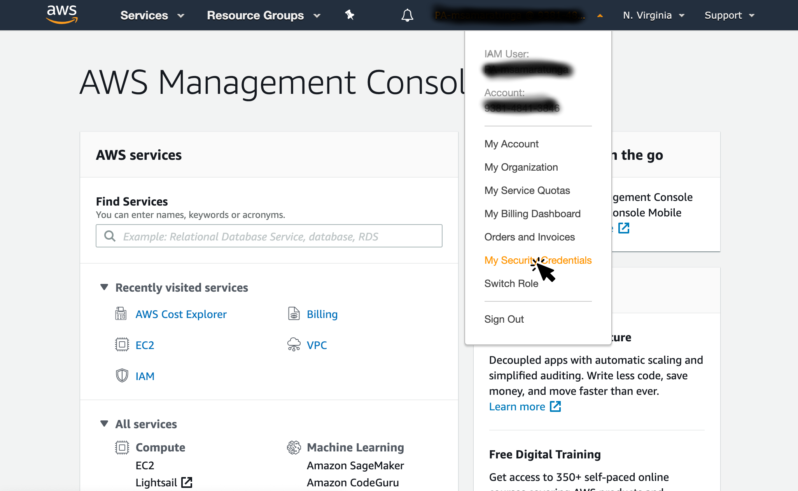
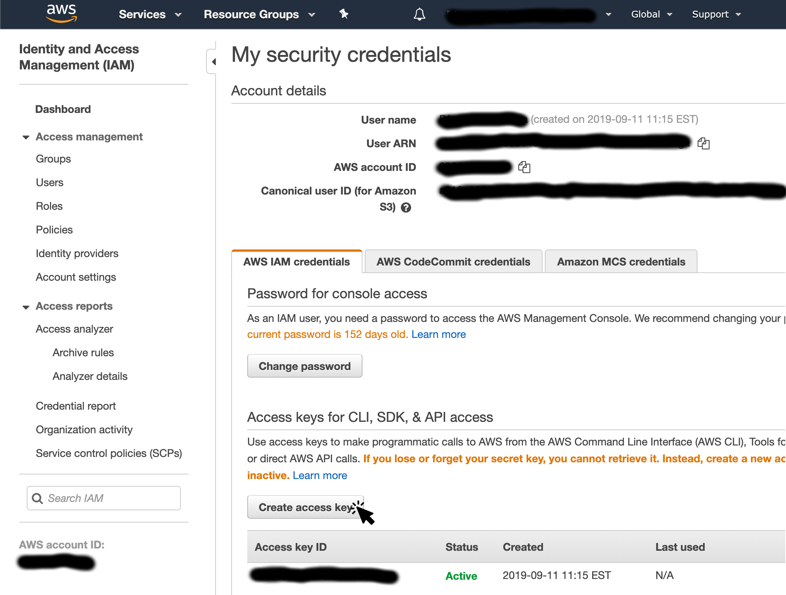
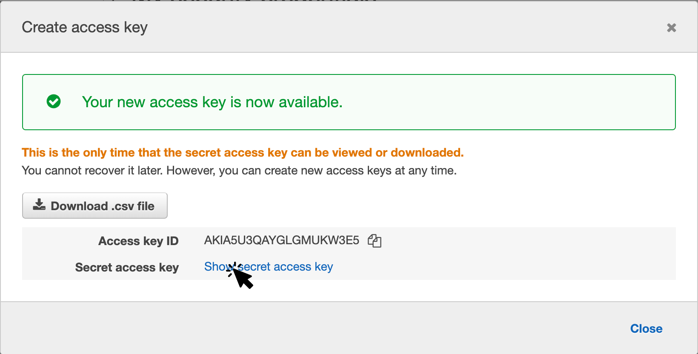

## Amazon Web Services (AWS)

Instructions to register and activate an AWS account can be found at the following URL.

* https://aws.amazon.com/premiumsupport/knowledge-center/create-and-activate-aws-account/

Once you have created your account you will need to login to your account and create an access key as shown in the link below.

1. Login to you newly registered account and navigate to the ["My Security Credentials"](https://console.aws.amazon.com/iam/home?region=us-east-1#/security_credentials) option.

  

2. Once on the "My Security Credentials" page click on the "Create access key button".

  

3. This will bring up the dialog show below with the newly created access key. Click on the "Show secret access key" link to get the secret key associated with access key just created.

  