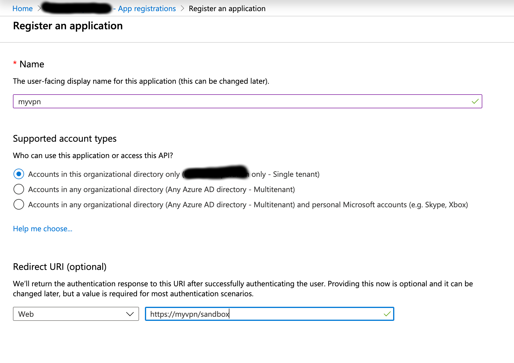
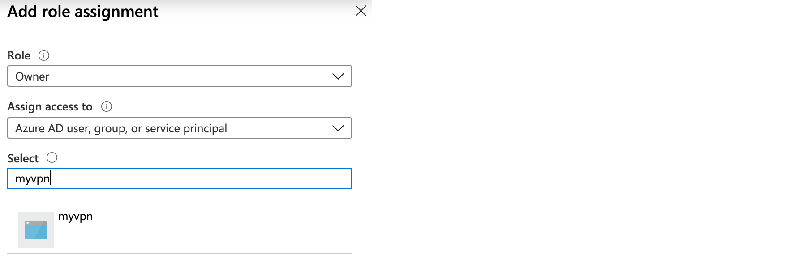

## Microsoft Azure

Instructions to sign-up for a Microsoft Azure account can be found at the following URL.

* https://www.youtube.com/watch?v=GWT2R1C_uUU

In order to be able to deploy recipes you need to create an Azure AD application and service principal. Detail instructions can be found at the following URL.

* https://docs.microsoft.com/en-us/azure/active-directory/develop/howto-create-service-principal-portal

* It is important to specify a `Redirect URI`. This does not need to have a valid endpoint but should be formatted as a URL i.e. https://myvpn/sandbox.

  

* Assign the role `Owner` to the newly created application

  

* For API access make sure you create an [application secret](https://docs.microsoft.com/en-us/azure/active-directory/develop/howto-create-service-principal-portal#create-a-new-application-secret).