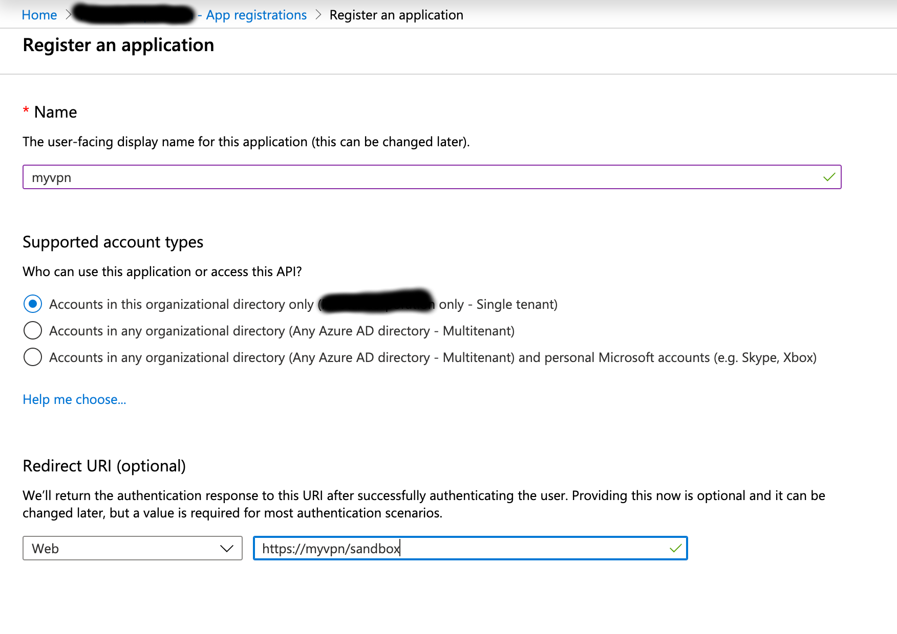
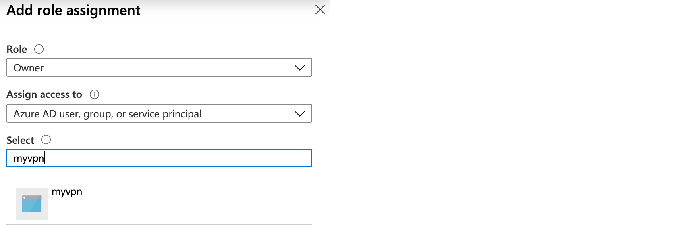

## Microsoft Azure

Instructions to sign-up for a Microsoft Azure account and subscription can be found at the following URL.

https://www.youtube.com/watch?v=GWT2R1C_uUU

### Setting up Access Credentials via Azure Portal

In order to be able to deploy recipes you need to create an Azure AD application and service principal. Detail instructions can be found at the following URL.

https://docs.microsoft.com/en-us/azure/active-directory/develop/howto-create-service-principal-portal

It is important to specify a `Redirect URI`. This does not need to have a valid endpoint but should be formatted as a URL i.e. https://myvpn/sandbox.



Assign the role `Owner` to the newly created application



For API access make sure you create an [application secret](https://docs.microsoft.com/en-us/azure/active-directory/develop/howto-create-service-principal-portal#create-a-new-application-secret).

### Setting up Access Credentials via Azure CLI

Instructions on installing the azure CLI can be found at the following URL.

https://learn.microsoft.com/en-us/cli/azure/install-azure-cli

Once the CLI is setup un the following commands similar to instructions found at the following URL.

https://registry.terraform.io/providers/hashicorp/azurerm/latest/docs/guides/service_principal_client_secret

1) Login to the Azure CLI using

```
az login -o table
```

2) List your subscriptions and note the `SubscriptionId` you want to create the service principal for.

```
az account list -o table
```

3) Create the service principal using the `SubscriptionId` from 2.

```
az ad sp create-for-rbac -o table --name="cbcli" --role="Owner" --scopes="/subscriptions/<SubscriptionId>"
```

4) Set your environment variables as follows using output from above:

```
export ARM_TENANT_ID=<TenantId from 2)>
export ARM_SUBSCRIPTION_ID=<SubscriptionId from 2)>
export ARM_CLIENT_ID=<AppId from 3)>
export ARM_CLIENT_SECRET=<Password from 3)>
```

5) Add additional API permissions (Directory.Read.All) to your service principal to access Microsoft Graph API.

```
az ad app permission add --id=$ARM_CLIENT_ID --api=00000003-0000-0000-c000-000000000000 --api-permissions 7ab1d382-f21e-4acd-a863-ba3e13f7da61=Role
az ad app permission admin-consent --id=$ARM_CLIENT_ID
```

> Examples for [az add app permission ...](https://learn.microsoft.com/en-us/cli/azure/ad/app/permission?view=azure-cli-latest)
