## Google Cloud Platform (GCP)

You need to sign up for a Google cloud account using you google SSO credentials. To begin navigate to the following URL.

https://console.cloud.google.com/

If you do not have Google account create one now. Then sign back in to the cloud console with those credentials via the URL above. This will take you to the landing page where you will need to click on the `Activate` button.

The `Activate` button will take you to a form which requests your information and a credit card for billing. If you are first time user you will receive free credits and you card will be charged on a pay as you go basis after those credits expire. You can manage your cost via the CLI by ensuring billable cloud resources are hibernated when not in use.

Once you have an active billable account you need to create a project where your cloud resources will be deployed by navigating to the [getting started](https://console.cloud.google.com/getting-started) page.

Click on the `Select a project` link to view the projects dialog.

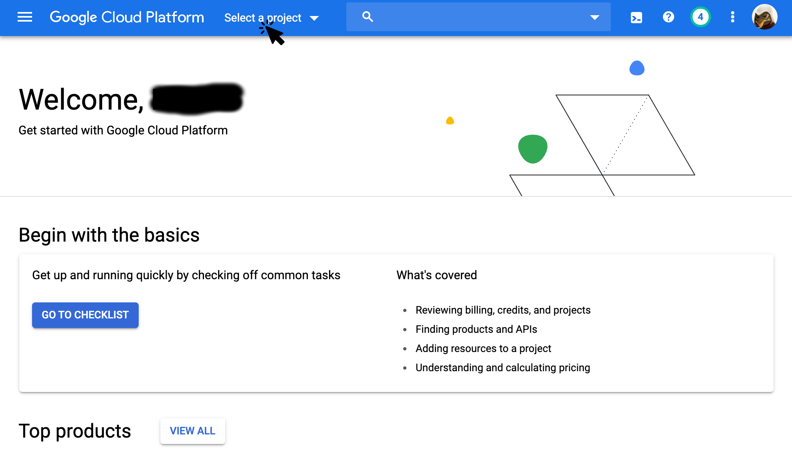

Click on the `NEW PROJECT` link to go the form to create a new GCP project.

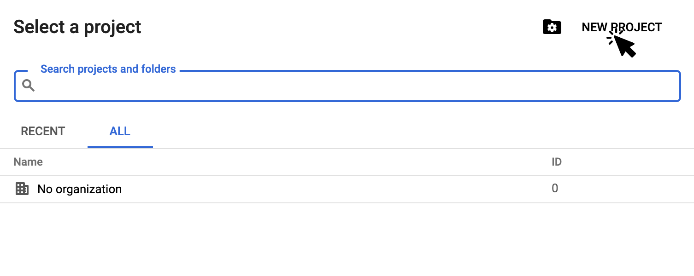

Give you project a name such as `MyVPN` and click on the create button.

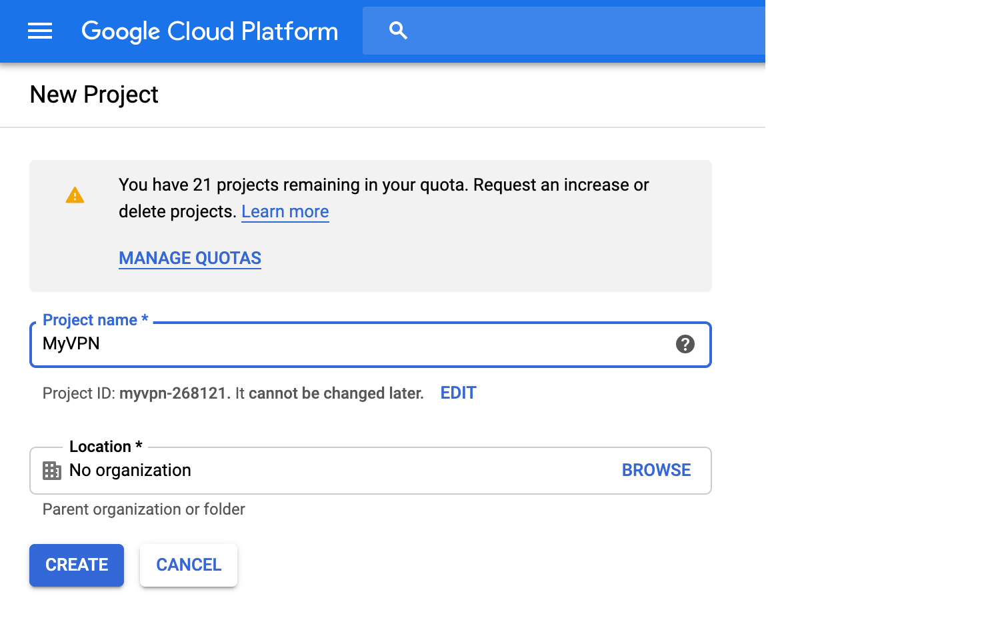

Now go back to the `Select a project` dialog and select the project you just created. You should be taken to your project dashboard. 

Click on the menu bar.

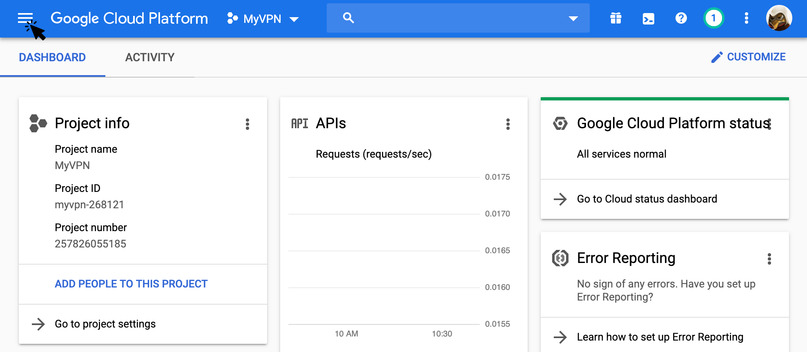

From the menu select `IAM & admin -> Service accounts`.

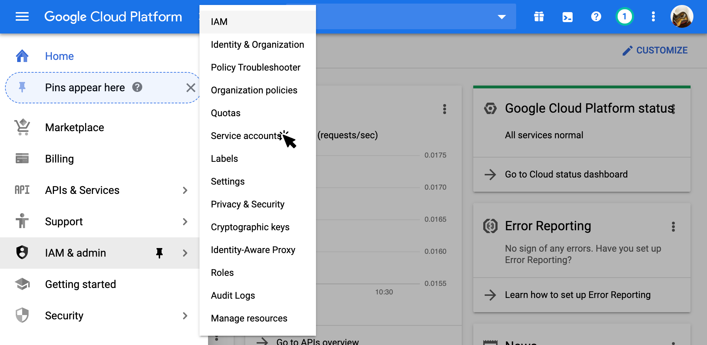

Click on the `CREATE SERVICE ACCOUNT` button.

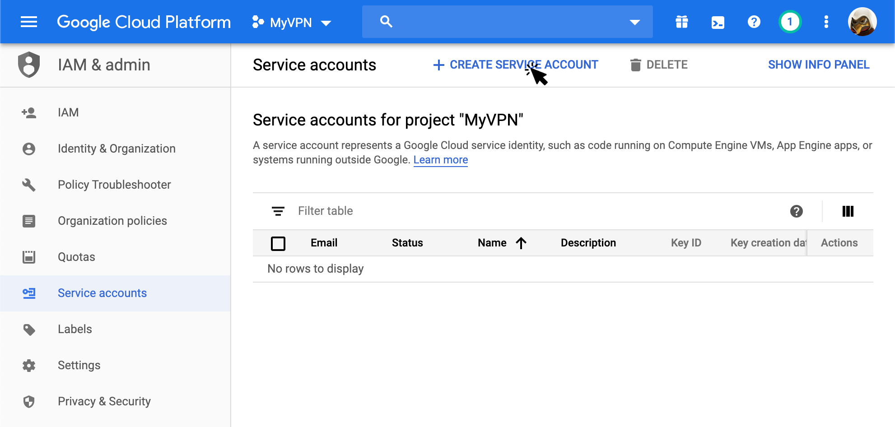

Give your service account a name such as `automation`, a different ID if there is a conflict and optionally a description.

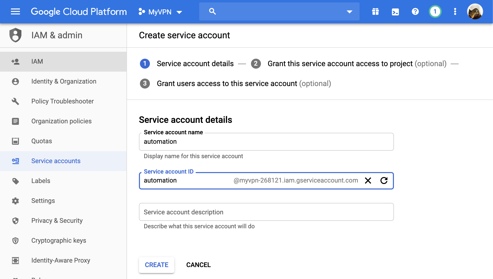

After account has been created you will be taken to a page to add roles to the service account. Click on the drop down for the role.

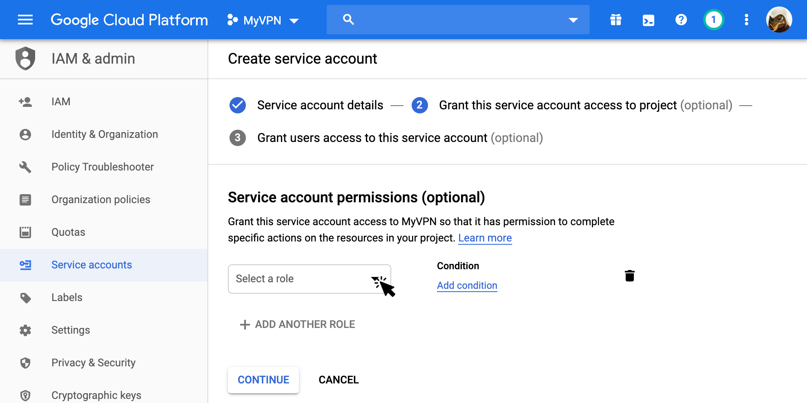

This will pull up a selection list for the roles.

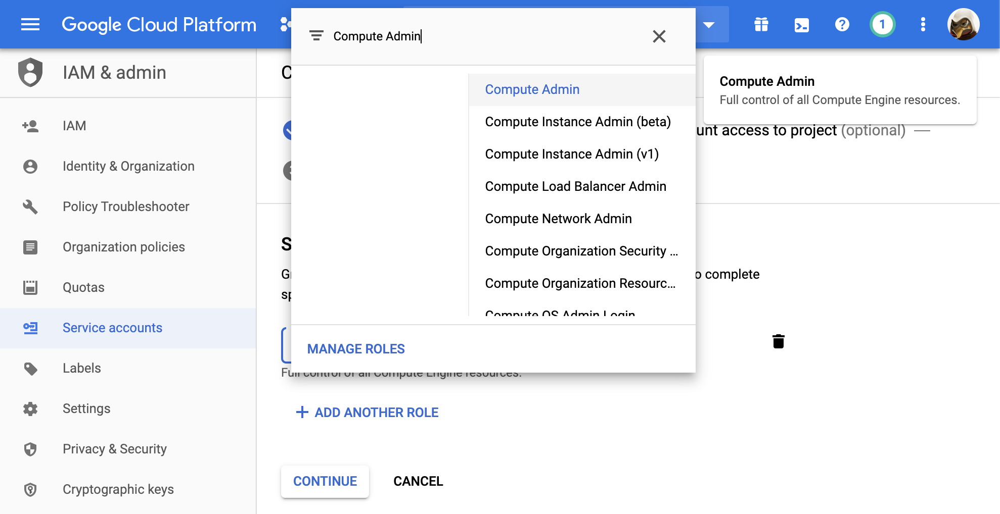

From the list pick one of the following roles. You can enter the role name in the search box to quickly look it up for selection. Once added add another role by clicking on the `ADD ANOTHER ROLE` button. Repeat until all the following roles have been added.

| Role                  |
| --------------------- |
| Cloud SQL Admin       |
| Compute Admin         |
| DNS Administrator     |
| Service Account Admin |
| Service Account User  |
| Project IAM Admin     |
| Storage Admin         |
| Storage Object Admin  |

Once done if you select the `IAM` option from the menu table of contents on the left hand side of the screen you will see the newly created service accounts and its roles. Click on the `Service accounts` option.

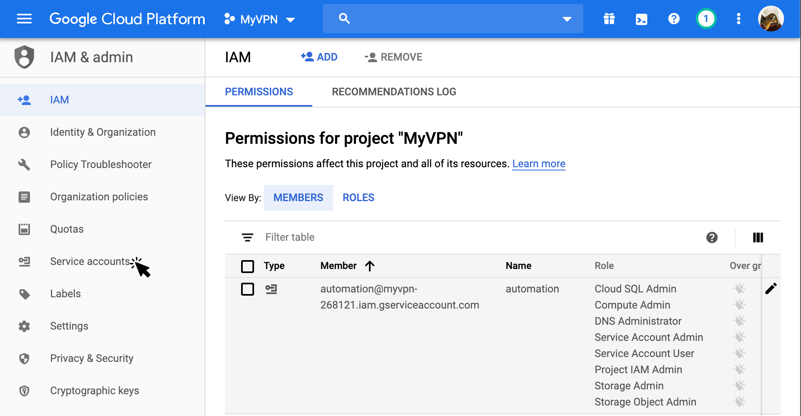

Click on the `Actions` column button to bring up the actions popup and click on the `Create Key` option from that popup.

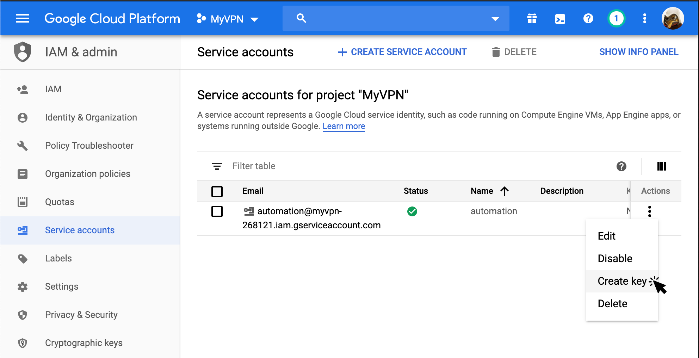

This will bring up a dialog to create a private key for automation. Make sure the key type selected is `JSON` and click on the `CREATE` button.

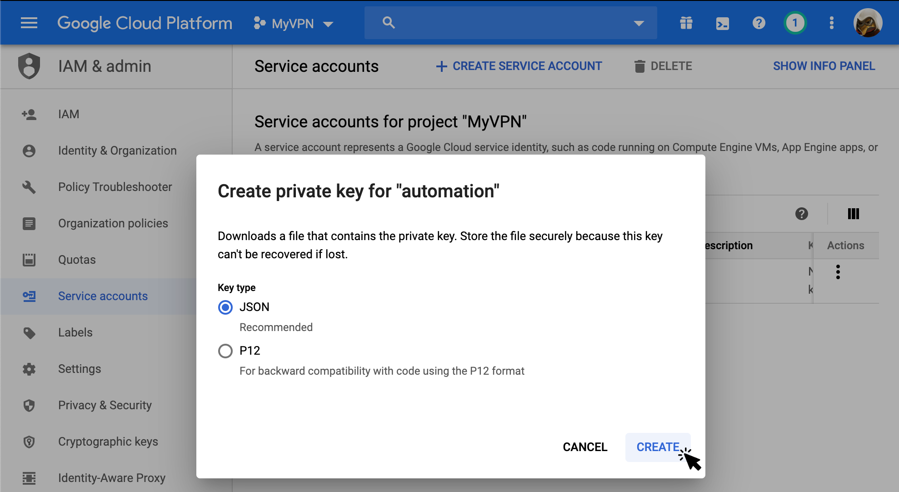

Your key should be downloaded to your download location. You will need to provide this path to the Cloud Builder CLI when configuring you Google Cloud provider.

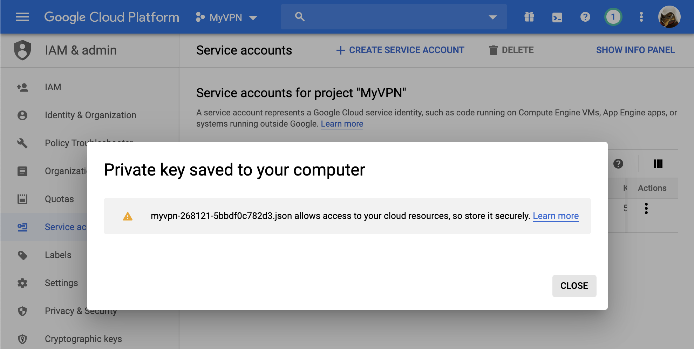
