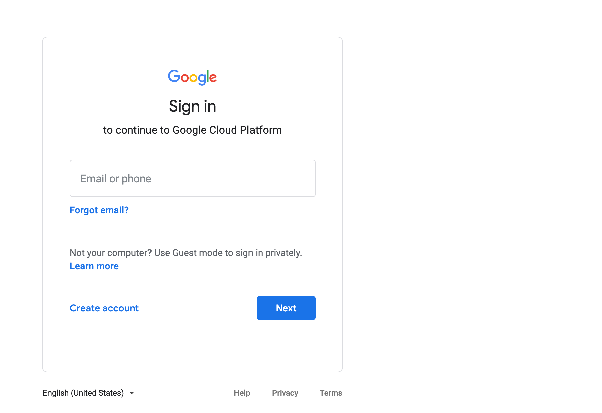
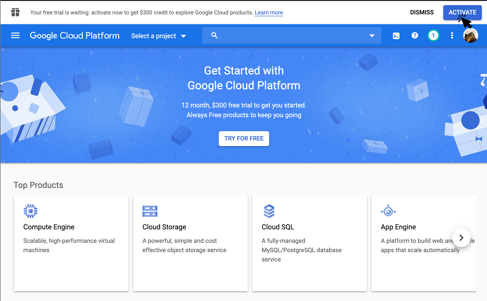

## Google Cloud Platform (GCP)

You need to sign up for a Google cloud account using you google SSO credentials. To begin navigate to the following URL.

https://console.cloud.google.com/

If you do not have Google account create one now. Then sign back in to the cloud console with those credentials via the URL above. This will take you to the landing page where you will need to click on the `Activate` button.

The `Activate` button will take you to a form which requests you information and a credit card for billing. If you are first time user you will receive free credits and you card will be charged on a pay as you go basis after those credits expire. You can manage your cost via the CLI by ensuring billable cloud resources are hibernated when not in use.
